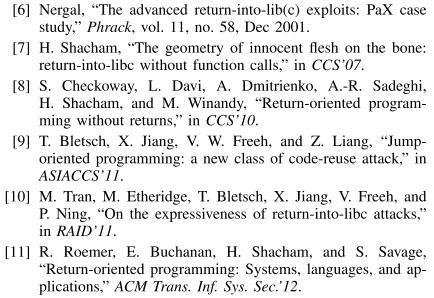
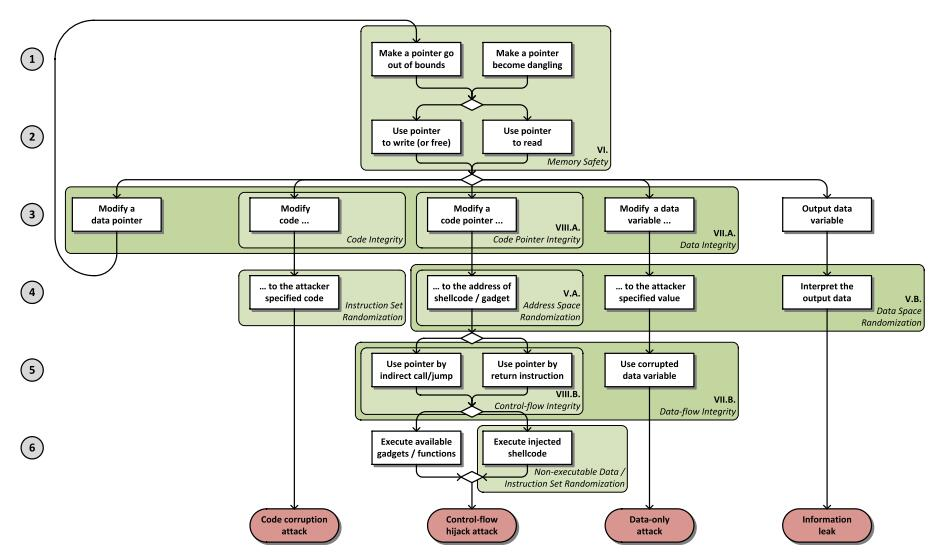
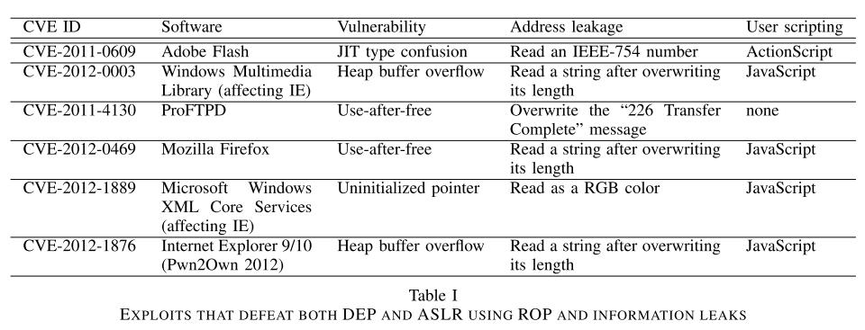

# SoK:Eternal War in Memory

[论文原文](https://ieeexplore.ieee.org/document/6547101)

## 概述

这是一篇 2013 年发表在 IEEES&P 上的综述文章，主要介绍了内存相关的攻击和防御手段。作者首先建立了一个模型，该模型将针对内存的攻击概括为特定的流程图，然后针对该流程图上的每一步，介绍了可能的具体攻击方法和对应的防护措施，最后对相关的防护方法研究进行了介绍和评估。

## Introduction

使用 C 或者 C++ 等较底层的编程语言写的程序容易出现内存损坏错误（Memory corruption bugs，可能的解决办法：避免使用这些语言，用**类型安全**的语言重写应用（不可能）

Q1：类型安全的语言是什么

> 只能做语言在定义上允许做的事情：数组、内存、强制转换、变量。。。
>
> （我理解为白名单系统和黑名单系统）
>
> 我觉得一个很好的回答：https://www.zhihu.com/question/19918532/answer/21647195

一些应对措施：Stack cookies、Data Execution Prevention、Address Space Layout Randomization，但是出现了其他的攻击方式（ROP）



存在很多的对保护方法的研究，但是并没有在实践中投入使用的原因：performance、compatible、robust、depends on toolchain that not available

提出问题：越来越多的攻击方式和应对方案，如何去进行评测哪一种方案的效率最高。评测点：robustness, performance, compatibility

论文完成的工作：

1. develop a general model of memory corruption attacks and identify different enforceable security policies based on the model;
2. clarify what attack vectors are left unprotected by currently used and previously proposed protections by matching their enforced polices with separate phases of different exploits;
3. evaluate and compare proposed solutions for performance, compatibility, and robustness;
4. discuss why many proposed solutions are not adopted in practice and what the necessary criteria for a new solution are.


## ATTACKS



矩形代表每一个可利用的模块、最底下的椭圆代表成功的攻击、菱形是一个选择点，可以改变不同的路径


### Memory Corruption

+ step1：利用编程时出现漏洞的指针
  + 指针非法越界：空指针解引用、缓冲区溢出、数组索引错误
  + 悬挂指针：(Temporal memory errors)：UAF

+ step2：
  + read：

      内存数据被修改

      ```c
      //没有边界检查
      func_ptr jump_table[3] = {fn_0, fn_1, fn_2};
      jump_table[user_input]();
      ```

      内存数据泄露

      ```c
      printf(user_input); // input "%3$x" prints the
      				// 3rd integer on the stack
      ```

  + write

    修改虚函数表，double free

    **with one memory error, more and more memory errors can be raised by corrupting other pointers**

  

### Code corruption attack

howto：overwrite the program code in memory

mitigation：Code Integrity policy

exception：self-modifying code or JIT compilation


### Control-flow hijack attack

+ step1：

  howto：Modify a code pointer（函数指针，保存的返回地址）

  mitigation：Code Pointer Integrity policy

+ step2：

  howto：find the correct target value (i.e., the address of the payload / gadget) 

  mitigation：introducing entropy to memory addresses using *Address Space Randomization*

+ step3：

  howto：exploit indirect function call, indirect jump or function return instruction

  mitigation：Control-flow Integrity (CFI) policy

+ step4：

  howto-1：execution of attacker specified malicious code (injected shellcode)

  mitigation：Non-executable Data policy 

  ​					 $W\oplus X$ (combine Code Integrity and Non-executable Data policy)

  ​						Instruction Set Randomization (ISR) 

  howto-2：reuse existing code in memory（ROP、JOP）

  mitigation： ？ CET (Control-flow Enforcement Technology)


### Data-only attack

also called “non-controldata attacks”，neither code nor code pointers (control data) are corrupted.

```c
bool isAdmin = false;
...
if (isAdmin)
// do privileged operationsc
```

+ step1

  howto：corrupt some security critical variable

  mitigation：Data Integrity policy

+ step2

  howto：replace the corrupted data

  mitigation：introducing entropy into the representation of all data using Data Space Randomization

+ step3

  howto：use the corrupted data variable

  mitigation：Data-flow Integrity


### Information leak

+ howto：using information leak bypass ASLR
+ mitigation：full Data Space Randomization


## CURRENTLY USED PROTECTIONS AND REAL WORLD EXPLOITS

### stack smashing protection

howto：place a random value (called cookie or canary) between the return address and the local buffers at function entries

windows：SafeSEH and SEHOP

### DEP/$W \oplus X$

protect against code injection attacks, cannot protect against code reuse attacks

### ASLR

exploit information leakage




## APPROACHES AND EVALUATION CRITERIA

protection techniques can be divided into two main categories：

1. probabilistic：ASLR、DSR。。。

2. deterministic：implementing a low-level reference monitor，eg W$\oplus$X 、 Control-flow Integrity。。。

   hardware：page permission

   embedding into code：Dynamic (binary) instrumentation 、taint checking

+ protection

  1. Enforced policy
  2. false negatives：漏报
  3. false positives：误报

+ Cost

  1. Performance overhead：CPU-bound benchmarks and I/O-bound benchmarks,
  2. Memory overhead：

+ Compatibility

  1. Source compatibility：An approach is source compatible (or source agnostic) if it does not require application source code to be manually modified to profit from the protection.

  2. Binary compatibility

     Q2：没看懂，什么是二进制兼容

     > 二进制兼容是针对动态链接库而言的。如果一个程序原来用旧版的库玩得很好，你偷偷给换成新版的库，他照样玩得很开心，甚至都不知道库换了，那你这个库就二进制兼容了。
     >
     > （source compatible 在这种情况下可能需要重新编译）
     >
     > A：https://blog.csdn.net/Willon_tom/article/details/5499259

  3. Modularity support

     a binary rewriter should support hardening each file (main executable or library) separately


## Probabilistic Methods

Probabilistic methods rely on randomization and secrets

three main approaches: *Instruction Set Randomization*（obsolete because of read-only page permissions and non-executable page permissions）, *Address Space Randomization*, and *Data Space Randomization*.

### Address Space Randomization

ASLR

**The protection can always be bypassed if not all code and data sections are randomized.**

+ 32-bit machine ASLR is ineffective against brute-force or de-randomization attacks

+ Information leaks are the primary attack vector against probabilistic techniques

+ A technique in the border-land between Address Space and Data Space Randomization is pointer encryption。（neither binary nor source code compatible.）

  （encrypts all pointers in memory and only decrypts them right before they are loaded into a register. ）

### Data Space Randomization

DSR randomizes the representation of data stored in memory, not the location. It encrypts all variables, not only pointers, and using different keys.

The code is instrumented to mask and unmask variables when they are stored and loaded from memory

（overhead、not binary compatible)


## MEMORY SAFETY

Q3：什么是 Temporal safety 和 Spatial safety

> 我的理解：
>
> Temporal safety：指针指向的东西是没有被释放的
>
> Spatial safety：指针没有越界

Enforcing Memory Safety stops all memory corruption exploits. 

(eg. type-safe languages)

### Spatial safety with pointer bounds（Softbound）

+ 对于每个指针建立一个表，记录开始地址和结束地址，每次解引用时候进行边界检查

+ keep track of pointer bounds
+ Pointer based bounds checking is capable of enforcing spatial safety completely without false positives or false negatives if and only if every module is protected

（兼容性较差）

### Spatial safety with object bounds

+ Instead of associating the bounds information with pointers, these systems associate the information with the objects

  通过计算判断指针是否指向正确的对象

+ Baggy Bounds Checking (BBC) 

  通过填充 object 到 2 的幂次，保持 unprotected libraries 兼容性做法：每次 malloc 或者 free 时候进行拦截

### Temporal safety

+ Special allocators

  e.g.：cling

+ Object based approaches (动态二进制插桩方法)

  e.g.：Memcheck、AddressSanitizer

  marking locations which were de-allocated in a shadow memory space

  (性能、内存开销大)

  Q4：什么叫 **Object based** 

  > 这种方法大概是维护了一种数据结构（shadow memory），在里面记录内存的是否被分配等信息

+ Pointer based approaches

  只设置一个标志位来表示这个对象是否被释放的状态是不够的，还需要更新所有指向这个对象的指针的状态

  （和上面的区别，每次都实时更新所有指向这个对象的指针的状态）
  
  CETS: compiler enforced temporal safety for C


## GENERIC ATTACK DEFENSES

### Data Integrity

+ Integrity of “safe” objects

  A pointer is considered unsafe if it might go out of bounds

  对不安全的区域进行代码插桩、检查：Checks are inserted before each write dereference of an unsafe pointer to check whether the location is marked in the shadow memory

  标记不安全对象的每个字节，在每次对对象进行写操作时候进行检查，该位置是否被标记

+ Integrity of points-to sets

  WIT（Write Integrity Testing）：WIT在编译时使用指针分析来计算控制流图和程序中每条指令可以写入的对象集。然后，它生成代码，以防止指令修改不在静态分析计算的集合中的对象，并确保控制流图允许进行间接控制传递。 

### Data-flow Integrity

detects the corruption of any data before it gets used by checking read instructions

DFI enforces the reaching definition sets？

Q5：什么是 reaching definition sets

> The reaching definition set of an instruction is the set of instructions which might have last written (defined) the value that is used by the given instruction based on the control-flow graph.


## Control-flow hijack defense

the Code Pointer Integrity aims to prevent the corruption of code pointers, Control-flow Integrity detects it

### Code Pointer Integrity

将进程占用的内存划分为安全区（safe region）和常规区(regular region)，安全区只能存放敏感指针和元数据（metadata，用来描述敏感指针指向对象的值，地址上下界，以及分配的时序id），同时对安全区的访问要么是在编译时证明安全的，要么是通过运行时安全检查的。对常规区的访问没有任何特殊之处。

- 指向函数的指针
- 指向敏感类型的指针
- 有成员是敏感类型的复合类型（结构体或数组）
- 泛型指针(void*, char*, 在定义结构体或类以前就声明的指针)
- 用户自定义的敏感类型 （如存储有操作系统UID信息的结构体）
- 所有在编译或运行是隐式生成的代码指针（返回地址，C++虚函数表，setjmp缓存）

对敏感代码指针进行操作的所有指令都需要进行安全检查

### Control-flow Integrity

+ Dynamic return integrity

  1. stack cookies/canary

     performance overhead is negligible (less than 1%) and no compatibility issues are introduced.

  2. Shadow stacks

     To eliminate the reliance on a secret, the saved return addresses are pushed to a separate shadow stack as well, so upon function return, the shadow copy can be compared with the original return address

+ Static control-flow graph integrity

  To prevent all control-flow hijacks, not only returns, but indirect calls and jumps have to be protected as well. 

  

## discuss & conclusion


+ compatibility problems are the main barriers of wide adoption
+ increased use of JIT compilation limits the usability of W⊕X policy
+ software protection techniques should built into commonly used compilers, such as LLVM and GCC

