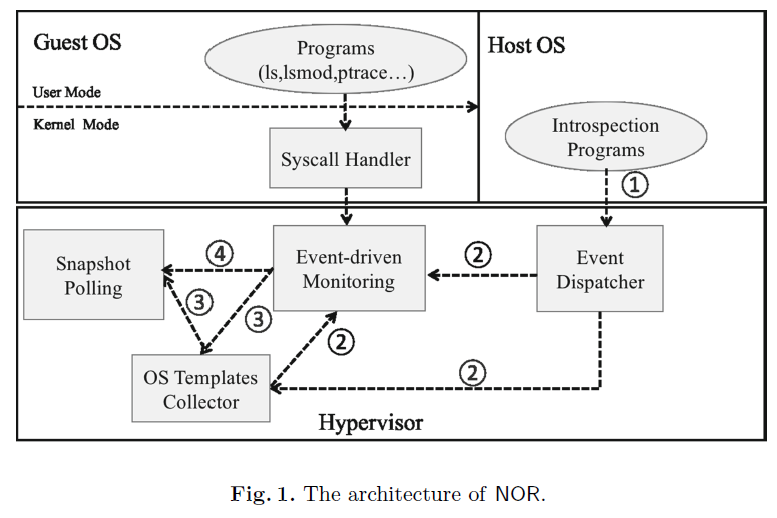

# NOR : Towards Non-intrusive, Real-Time and OS-agnostic Introspection for Virtual
Machines in Cloud Environment

## Purpose

+ Using VMI, a VM monitoring application reconstructs the internal state of a monitored VM (e.g., running processes, opened files and active network connections, etc.) from the byte values in the VM's memory pages, which is more reliable than retrieving information within the guest OS. 

+ Semantic gap（语义鸿沟） exists bescause at the hypervisor layer, we have access only to the raw data of the hardware level state of a VM (e.g., CPU registers, physical memory or even instructions etc.). 

+ What we want is the semantic information about the guest OS state, such as the variables being accessed, variable types, and guest OS kernel events to obtain meaningful guest OS state information.

## State-of-the-Art

Three main problems：

1. intrusiveness : adding hooks or programs inside the guest to help for retrieving information
   + drawback：make introspection tools easy to be detected by advanced malware)
2. Time lag : fail to guarantee the introspection information up-to-date by employing snapshot polling of guest states
   + drawback：Attackers may launching transient attacks durning the interval and restore the modifications to normal
3. OS-dependence : need to rebuild introspection tools according to detailed, up-to-date information about the internal workings of commodity OSes.
   + drawback：requires the administrator to maintain customized monitor VMs and introspectiontools for different guest OSes，too trivial.

dimensions：

1. Whether hardware assistance is required
2. How it solves the semantic gap problem
3. How introspection is triggered

## Approach

### Architecture

### Event-Driven Monitoring

make syscall trap into VMM??

### Snapshot Pool

libvmi and forensic....

## Related Works

+ Real-Time Deep Virtual Machine Introspection and Its Applications

  使用 Volatility 进行内存取证

  

