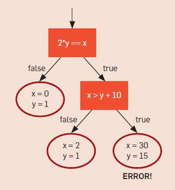

# Symbolic Execution for Software Testing Three Decades Later

[论文原文](https://dl.acm.org/doi/10.1145/2408776.2408795)

## Overview

符号执行的介绍和入门

符号执行背后的关键思想是使用符号值，而不是具体的数据值作为输入值，以符号表达式表示程序变量的值。程序计算的输出值也需要被表示为输入符号值的函数。

All the feasible execution paths of a program : execution tree

```c
int twice (int v) {
	return 2*v;
}

void testme (int x, int y) {
	z = twice (y);
	if (z == x) {
		if (x > y+10) {
			ERROR;
		}	
        }
}
/* simple driver exercising testme () with sym inputs */
int main() {
        x = sym_input();
        y = sym_input();
        testme (x, y);
        return 0;
}
```



> 符号执行的目的是生成类似的一组输入，以便可以通过在这些输入上运行程序来精确地探索所有可行的执行路径（或在给定的时间预算内尽可能多的执行路径）

### Principle

Symbolic State $\sigma$ : maps variables to symbolic expressions

Path Constraint (PC) : quantifier-free first-order formula（无量词一阶公式）

+ **initital**

  $\sigma = \{empty\},\ PC = true$

+ **run**

  > 1. $\sigma = \{empty\},\ PC = true$
  >
  > 2. $\sigma=\{x\rightarrow x_0,y\rightarrow y_0\}\ x_0,y_0$ are 2 unconstrained symbolic values 
  >
  >    every assignment update $\sigma$, $\sigma=\{x\rightarrow x_0,y\rightarrow y_0,z\rightarrow2y_0\}$
  >
  >    every conditional statement $if(e)\ S1\ then\ S2$, update PC 
  >
  >    $PC = PC\wedge \sigma(e)$ ("then" | branch)
  >
  >    $new\ PC' = PC\wedge \neg\sigma(e)$ ("else" | branch)
  >
  >    例如第七行的路径约束是 $x_0=2y_0, x_0\neq2y_0$
  >
  >    第八行新的路径约束是 $(x_0=2y_0)\wedge(x_0>y_0+10)$ 和 $(x_0=2y_0)\wedge(x_0\leq y_0+10)$
  >
  >    

  如果遇到程序退出或者错误，符号执行终止并生成一个约束值并求解具体输入，具体输入和此时有相同的路径

+ **end**

  solve PC using a constraint solver to generate concrete input values

### 循环和递归

循环或者递归可能造成无限个路径分支

```c
void testme_inf() {
	int sum = 0;
	int N = sym_input();
	while (N > 0) {
		sum = sum + N
               N = sym_input();
	}
}
```

可能的结果：很多 True 后面跟一个 false

$\sigma=\{N\rightarrow N_{n+1},sum\rightarrow \Sigma_{i\in[1,n]}N_i\}$

$(\bigwedge_{i\in[1,n]}N_i>0)\wedge (N_{n+1} \leq 0)$ 

### 无法求解

如果上文中的 `twice` 函数找不到源码，就无法求解（静态符号执行的问题）


## 现代符号执行技术

### Concolic Testing

混合符号执行，也是动态符号执行技术

维护一个实际状态和符号化状态，实际状态将所有变量映射到实际值，符号状态只映射那些有非实际值的变量。Concolic执行首先用一些给定的或者随机的输入来执行程序，收集执行过程中条件语句对输入的符号化约束，然后使用约束求解器去推理输入的变化，从而将下一次程序的执行导向另一条执行路径。简单地说来，就是在已有实际输入得到的路径上，对分支路径条件进行取反，就可以让执行走向另外一条路径。这个过程会不断地重复，加上系统化或启发式的路径选择算法，直到所有的路径都被探索，或者用户定义的覆盖目标达到，或者时间开销超过预计。

以上文中程序举例：

> 初始化输入 $\{x=22,y=7\}$ ，生成约束 $x_0 \neq 2y_0$
>
> 对约束取反得到 $x_0 = 2y_0$，生成输入 $\{x=2,y=1\}$，这个新的输入触发了新的路径，
>
> 后续的执行中生成了新的约束 $(x_0 = 2y_0)\wedge(x_0\leq y_0 +10)$ ，取反之后得到 $(x_0 = 2y_0)\wedge(x_0> y_0 +10)$ ，生成输入  $\{x=30,y=15\}$ ，探索完毕所有路径

（深度优先策略）

### Execution-Generated Testing (EGT)

本文作者Cristian Cadar在2006年发表EXE，以及2008年发表EXE的改进版本KLEE，对上述concolic执行的方法做了进一步优化。其创新点主要是在实际状态和符号状态之间进行区分，称之为执行生成的测试（Execution-Generated Testing），简称EGT。这个方法在每次运算前动态检查值是不是都是实际的，如果都是实际的值，那么运算就原样执行，否则，如果至少有一个值是符号化的，运算就会通过更新当前路径的条件符号化地进行。

例如，对于我们的例子程序，第17行把y=sym_input()改变成y=10，那么第6行就会用实际参数20去调用函数twice，并实际执行。然后第7行变成if(20==x)，符号执行会走then路径，加入约束x=20；对条件进行取反就可以走else路径，约束是x≠20。在then路径，第8行变成if(x>20)，那么then路径就不能走了，因为此时有约束x=20。简言之，EGT本质上还是将实际执行与符号执行相结合，通过路径取反探索所有可能路径。

可能会造成路径丢失的问题

## 面临的挑战

### 路径爆炸

符号执行隐式过滤两种路径：不依赖于符号输入的路径、对于当前的路径约束，不可解的路径。尽管符号执行已经做了这些过滤，路径爆炸依旧是符号执行的最大挑战。

+ 启发式探索
+ 利用可靠的程序分析技术来减小路径爆炸的复杂度

### 约束求解

+ 去除不相关的约束
+ 递增求解

